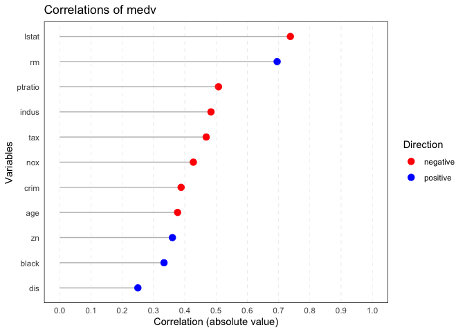

<!-- README.md is generated from README.Rmd. Please edit that file -->

# ryx

<!-- badges: start -->
<!-- badges: end -->


The goal of ryx is to provide a package for conducting correlation
analysis, summarizing the results, and visualizing the findings in a
publication-ready format. The package is designed to simplify the
process of calculating correlation coefficients between a dependent
variable (y) and one or more independent variables (x), and to produce
easy-to-read summaries and plots for quick interpretation.

## Installation

You can install the development version of ryx like so:

``` r
# Install the ryx package
install.packages("ryx")
#> Error in install.packages : Updating loaded packages
```

``` r
# Install the MASS package
install.packages("MASS")
#> Error in install.packages : Updating loaded packages
```

## Example

This is a basic example which shows you how to solve a common problem:
It uses the Boston dataset from the MASS package. The goal is to analyze
the correlations between the dependent variable medv (median house
value) and the independent variables in the dataset.

``` r
library(MASS)
library(ryx)
```

This command runs the correlation analysis on the Boston dataset, with
medv as the dependent variable.

``` r
# Perform correlation analysis
result <- ryx(Boston, y = "medv")
```

``` r
# Print the result
print(result)
#> Correlations of medv with
#>  variable      r p_display sigif
#>     lstat -0.738  5.08e-88   ***
#>        rm  0.695  2.49e-74   ***
#>   ptratio -0.508  1.61e-34   ***
#>     indus -0.484  4.90e-31   ***
#>       tax -0.469  5.64e-29   ***
#>       nox -0.427  7.07e-24   ***
#>      crim -0.388  1.17e-19   ***
#>       age -0.377  1.57e-18   ***
#>        zn  0.360  5.71e-17   ***
#>     black  0.333  1.32e-14   ***
#>       dis  0.250  1.21e-08   ***
```

The print() function displays the correlation results in a table format,
showing the correlation coefficient (r), p-value, and significance level
for each independent variable.

``` r
# Visualize the correlation results
plot(result)
```

 The
plot() function generates a ggplot-based visualization of the
correlation results, displaying correlation strength and direction for
each independent variable.

``` r
# Summarize the correlation analysis
summary(result)
#> Correlating lstat rm ptratio indus tax nox crim age zn black dis 
#> The median absolute correlation was 0.427 with a range from 0.25 to 0.738 
#> 11 out of 11 variables were significant at the p < 0.05 level.
```

The summary(result) provides a summary of the correlation analysis,
including the median absolute correlation, the range of correlations,
and the number of significant correlations.
